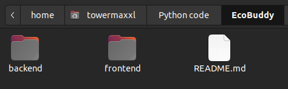
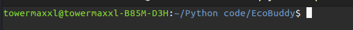
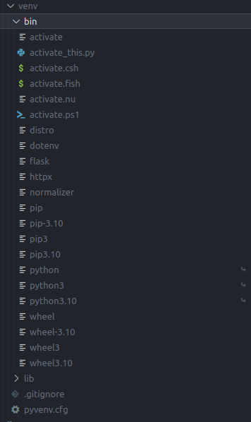
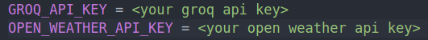

# RUN the project:

## Open Terminal

Open terminal in the cloned repository directory. 

Right click and click `open in terminal`

Navigate to backend directory: `cd backend`

## Create Virtual Environment:

Use `python3 -m venv venv` to  create a virtual environment named venv.

Check if folder `venv/bin` looks like this:

*IF NOT* delete venv folder and use: `virtualenv -p python3 venv`

## Activate Virtual Environment:
                
On Windows, use `.\venv\Scripts\activate` to activate the virtual environment.

On macOS/Linux, use `source venv/bin/activate`

*IF* virtual environment was succesfully activated you should see something like this:

## Install Dependencies:

Run `pip3 install -r requirements.txt` to install the dependencies.

## Setup environmetal variables

Create `.env` file in backend folder: `touch .env`, and fill it like this:

## Run the project

Use `python3 run.py` to run the project.

## Test project

Use `python3 test.py` and see if everything works.

